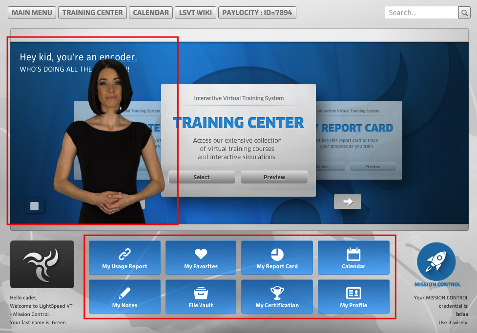
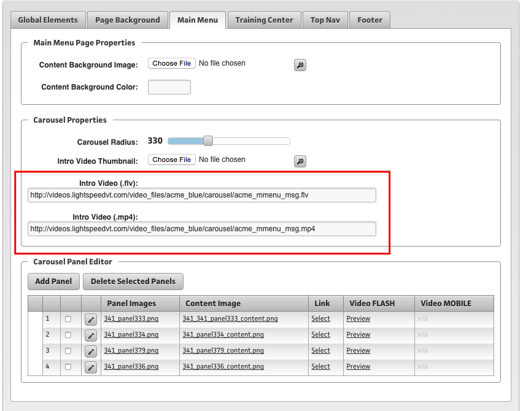
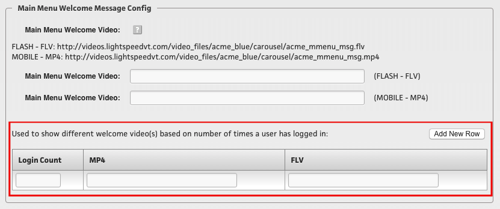

##Overview

The Main Menu is the first place a user will see when they login to their system. After a system is themed, the System Architecture team will take over managing the Main Menu Welcome Message and System Modules area of this screen.  

##Main Menu Welcome Message

There are several ways a Main Menu Welcome Message can be configured. The purpose of this section is to explain how the messages can be configured and explain which message is shown at which time.

###Configuration

Main Menu Welcome Messages can be set in one of the following ways:

1. **Group/Theme**
    - The main welcome message is added to the system through the Theme of the group. **(Old Themer)**
2. **Location**
    - Individual Locations can override the Group/Theme welcome message by adding one at this level. **(Location Settings)**
3. **By Access Level/Content Role**
    - You can override the Group and Location welcome message by configuring it to play by access level or content role. **(Manage Groups)**
4. **By Login Count**
    - Login Count will override all of the previous 4 setups and play a welcome message based on how many times a user has logged in. After this is played for that login count, it will revert back to the previous configuration. **(Location Settings)**

###1. Group/Theme

You can access the old themer through **403 - Theme Management**. Select a theme from the drop down, and then click on the **Main Menu** tab at the top.

Under the Carousel Properties you can enter the path to the desktop and mobile version of the main menu welcome message.

    

        Note
    

    

Even if a system is on the NEW themer, as of 8/19/2015 you will still need to set this here.
    

###2. Location

You can set the location main menu welcome message through the Location Settings in the quick links hamburger menu. You will need to super user access the location you wish to update, and then access those settings.

The two video paths you see in this section indicate which main menu welcome messages are set at the Themer. 

###3. Access Level/Content Role

To override the previous two settings, you can set the main menu welcome message to play based upon a user's access level or content role. 

You can set this in **401 - Group Management**, under the Main Menu Welcome Message Config section.

You can set as many of these up as you need by clicking "add new row" to create more fields.

###4. Login Count

Login Count will override all of the previous settings. 

If you configure a main menu welcome message to play on the users 5th login, then the main menu welcome message will play automatically upon that users 5th login. Upon their 6th login and beyond, the main menu welcome message will NOT autoplay - and if a user hits the Play button they will see the main menu welcome message from how it was configured previously to the 5th login.

Like #2 above, the Login Count configuration is set in **Location Settings**. You will need to first super user access the location you wish to configure.

##System Modules

System Modules are buttons users can click on for quick access to different reports and pages within their system. This section will cover how those are configured.

###Configuration

System Modules are configured from **403 - Theme Management**. Once you select which theme to edit, click on the **Components** drop down menu, and then click on **Menus**.

From there, scroll down to the System Modules section. From there, you can Delete or Edit any module:

To add a new module, scroll up to the top of the page and click on **+ New Menu Item**.

Your options here are:

1. Menu Label
    - Enter in the title or label your button will have. Be careful with the length of the title as it can cause the text to "fall off" of the button if it is too long.
2. Url Link
    - Enter the link where this button should take the user. If it's within the LSVT system you can use a relative link. If it is outside the system you'll need to use a full link.
3. _self or _blank
    - _self will open the link in the current browser window. _blank will open it in a new window. Typically if it's an outside link you will want to use _blank, so the user will still have their LightSpeed sessino open in a window.
4. Rank
    - Enter the ranking - or which order this should appear on the button bed.
5. Icon
    - You can choose from a list of icons found <a href="http://www.google.com/url?q=http%3A%2F%2Fcodepen.io%2Flsvt-casey%2Fpen%2Fyxnaf&sa=D&sntz=1&usg=AFrqEzeLRMvJF15BWtI7JANLGX7JdF1_yw" target="_blank">HERE</a>. To use one of the icons, simply type "icon-" and then the name of the icon.

And then finally, be sure to select the **System Modules** checkbox to place this in that section.

    

        Note
    

    

Any System Module addition/deletion/change you make is also being mirrored in the Hamburger menu. 
    

