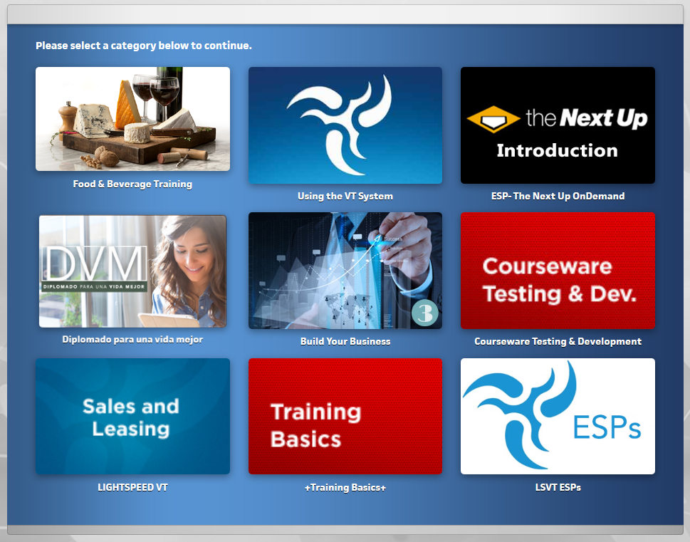

#Artwork Design - Overview

This section will cover all of the steps to create topic, category and course tiles that will live in the Training Center.

##Image Specs

Topics and Categories are now the same size - in older systems they are not - but moving forward you can use the same template for both. We list them both here just to keep the distinction, but they are the same file.

Object | Size | Download  
--------------- | --------------- | ---------------
Topic | 556x298 | [Download Photoshop Template](/files/cwtile_topic_556x298.psd)  
Category | 556x298 | [Download Photoshop Template](/files/cwtile_cat_556x298.psd)  
Course | 348x260 | [Download Photoshop Template](/files/cwtile_crs_556x298.psd)  

<!-- Old cat size left here just in case 
Category (Old): 360x216 - [Download Photoshop Template](/files/topic_556x298.psd)

Note - also need to speak with Tate on file sizes, how can we optimize these 
 -->

###Topics & Categories - 556x298

Here are some examples of how they look in the system (click to embiggen) - you do not need to change the file size - the system will automatically scale it to the correct size.

4 wide
-----------------

3 wide
-----------------

2 wide
-----------------

###Courses - 348x260

Course tiles do not scale up or down like Topics/Categories, they'll stay the same size. Here is an example of what they look like.

Course Menu
-----------------

Chapter Menu
-----------------

